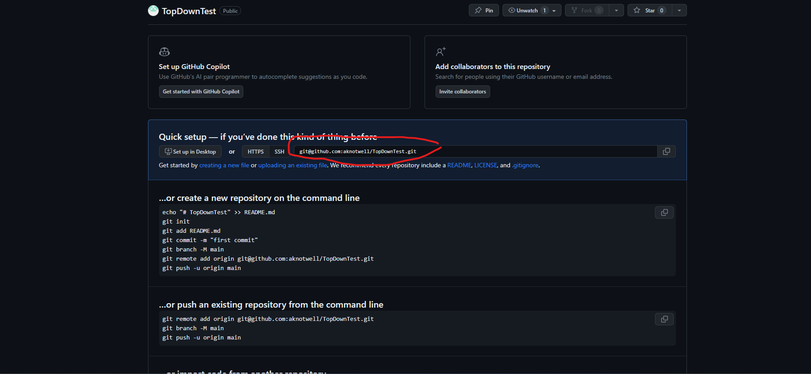

# Local Onboarding Notes 

**NB:** Document assumes you have [set up](https://docs.github.com/en/authentication/connecting-to-github-with-ssh/adding-a-new-ssh-key-to-your-github-account) your public key on Github to allow commits. 


1. Copy and paste the git ignore file below into a text editor.
2. Save text file as _.gitignore_ in your Unity Game Project Directory. 
3. Open git bash and change to Unity Game Project Directory using the `cd` command.
4. Run the following command to initialize your local repository: `git init --initial-branch=main`.
5. Add git ignore file: `git add .gitignore`.
6. Commit locally: `git commit -m "Initial Commit with ignore"`.
7. [Create Repository](https://docs.github.com/en/repositories/creating-and-managing-repositories/creating-a-new-repository) on GitHub and copy clone link. (see screenshot below)
8. Link local repository to the newly created repository: `git remote add origin <GITHUB_REPOSITORY_URL>`
9. Push local changes remotely: `git push --set-upstream origin main`.




## Git Ignore File

File below was created when creating a GitHub repository and choosing the Unity _.gitignore_ file: 

```{shell}
# This .gitignore file should be placed at the root of your Unity project directory
#
# Get latest from https://github.com/github/gitignore/blob/main/Unity.gitignore
#
/[Ll]ibrary/
/[Tt]emp/
/[Oo]bj/
/[Bb]uild/
/[Bb]uilds/
/[Ll]ogs/
/[Uu]ser[Ss]ettings/

# MemoryCaptures can get excessive in size.
# They also could contain extremely sensitive data
/[Mm]emoryCaptures/

# Recordings can get excessive in size
/[Rr]ecordings/

# Uncomment this line if you wish to ignore the asset store tools plugin
# /[Aa]ssets/AssetStoreTools*

# Autogenerated Jetbrains Rider plugin
/[Aa]ssets/Plugins/Editor/JetBrains*

# Visual Studio cache directory
.vs/

# Gradle cache directory
.gradle/

# Autogenerated VS/MD/Consulo solution and project files
ExportedObj/
.consulo/
*.csproj
*.unityproj
*.sln
*.suo
*.tmp
*.user
*.userprefs
*.pidb
*.booproj
*.svd
*.pdb
*.mdb
*.opendb
*.VC.db

# Unity3D generated meta files
*.pidb.meta
*.pdb.meta
*.mdb.meta

# Unity3D generated file on crash reports
sysinfo.txt

# Builds
*.apk
*.aab
*.unitypackage
*.app

# Crashlytics generated file
crashlytics-build.properties

# Packed Addressables
/[Aa]ssets/[Aa]ddressable[Aa]ssets[Dd]ata/*/*.bin*

# Temporary auto-generated Android Assets
/[Aa]ssets/[Ss]treamingAssets/aa.meta
/[Aa]ssets/[Ss]treamingAssets/aa/*

```
 
